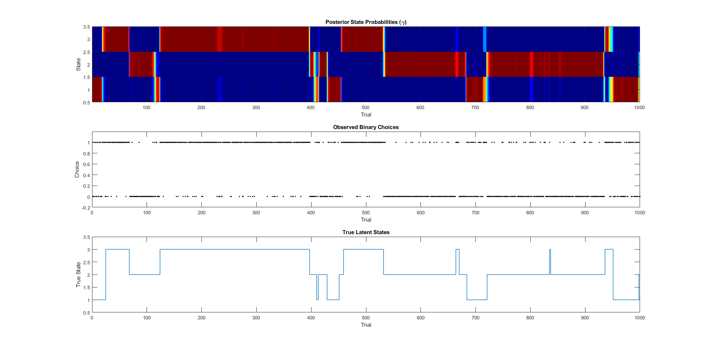

# GLM-HMM MATLAB Toolbox

A simple and modular MATLAB implementation of the Generalized Linear Model Hidden Markov Model (GLM-HMM), adapted from Ashwood et al. (2022). This toolbox allows fitting latent behavioral states to choice data using state-specific GLMs and EM inference.  
see the following link for the authors notebooks (python implementation)  
https://github.com/zashwood/ssm/blob/ster/noteboomaks/2b%20Input%20Driven%20Observations%20(GLM-HMM).ipynb  


---

## 🧠 What It Does

- Infers discrete latent behavioral states (e.g., “stimulus-driven”, “biased left/right”)
- Supports 2AFC and Go/No-Go paradigms
- Uses EM algorithm with GLM-based emission models
- Works on both real and simulated behavioral data

---

## 🚀 Getting Started

### Requirements
- MATLAB R2018 or newer
- No additional toolboxes required

---


### 🧪 Demo: Simulated Data

To test the toolbox on ground-truth simulated behavior:

```matlab
run demo/Demo_simulated_data.m
```

---





---

### 🔁 Example: Fit to Your Own Data

Prepare two vectors:
- `stimIntensity` — stimulus strength per trial (e.g., signed amplitude)
- `trialOutcome` — binary trial outcome (0 = left/no-lick, 1 = right/lick)

```matlab
addpath(genpath('path/to/GLM-HMM-MATLAB'))

params.GLMHMM.K = 5;              % number of latent states
params.GLMHMM.max_iter = 100;
params.GLMHMM.tol = 1e-3;
params.GLMHMM.pop_weigths = 1;
params.GLMHMM.display_output = 1;

Results = Fit_GLMHMM_GNGdata(stimIntensity, trialOutcome, params.GLMHMM);
```

---

## 📈 Outputs

`Results` contains:
- `dom_state` — most probable latent state per trial
- `performance` — GLM classification accuracy per state
- `W` — GLM weights (one vector per state)
- `gamma` — posterior over latent states (T x K)

---

## 📜 License

Released under the [MIT License](LICENSE).  
Free for academic and commercial use. No warranty provided.

---

## 🧩 Citation

Adapted from:

> Ashwood, Z. C., Roy, N. A., Stone, I. R., et al. (2022).  
> *Mice alternate between discrete strategies during perceptual decision-making*.  
> Nature Neuroscience, 25(2), 201–212.
> [https://doi.org/10.1038/s41593-021-01007-z]